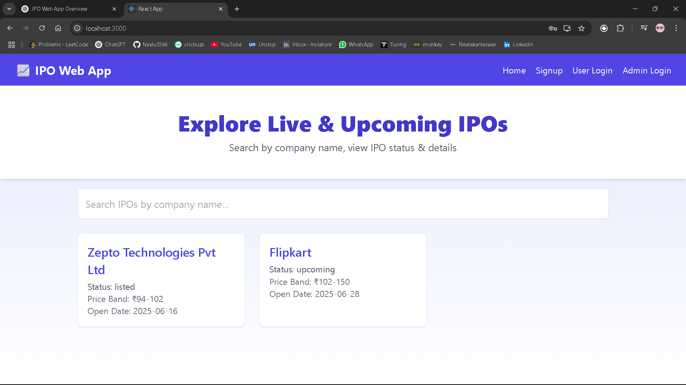
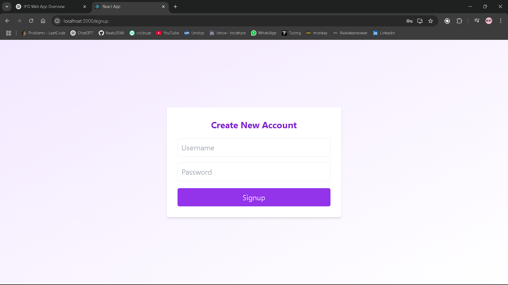
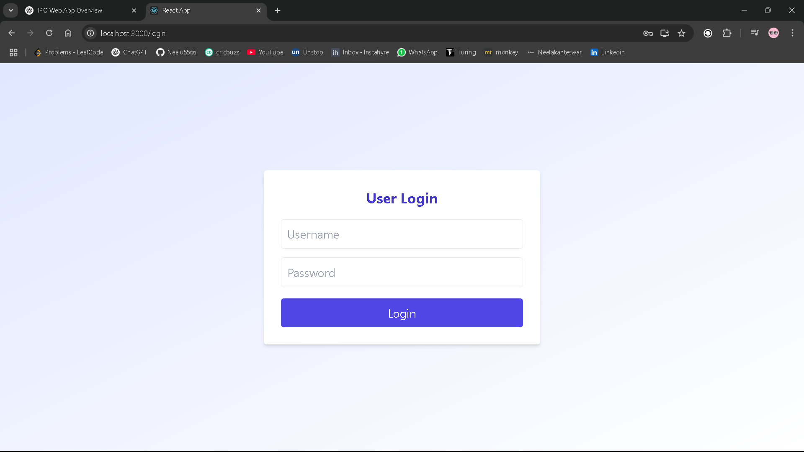
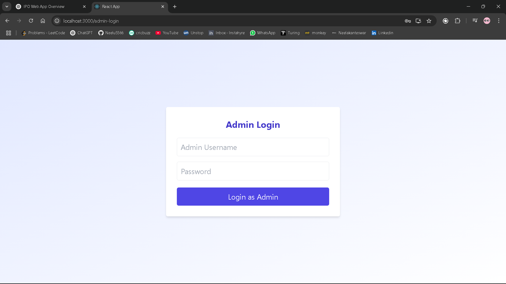
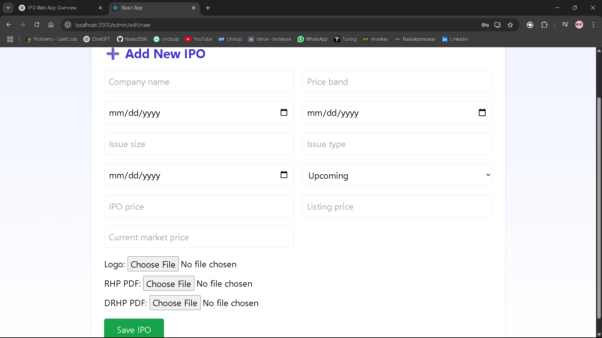
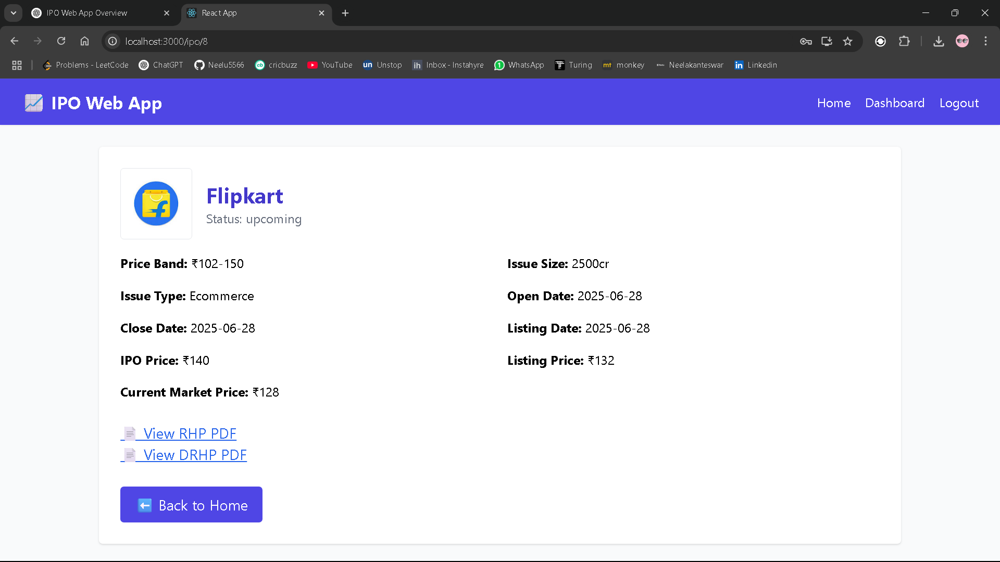
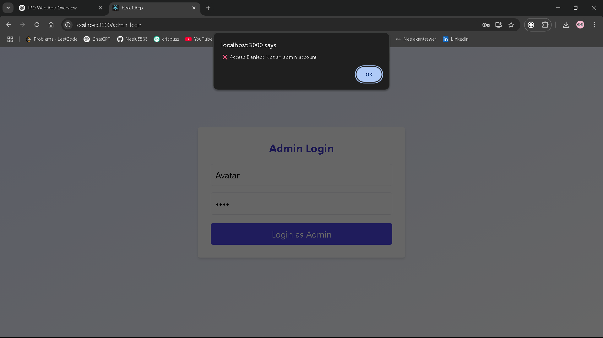
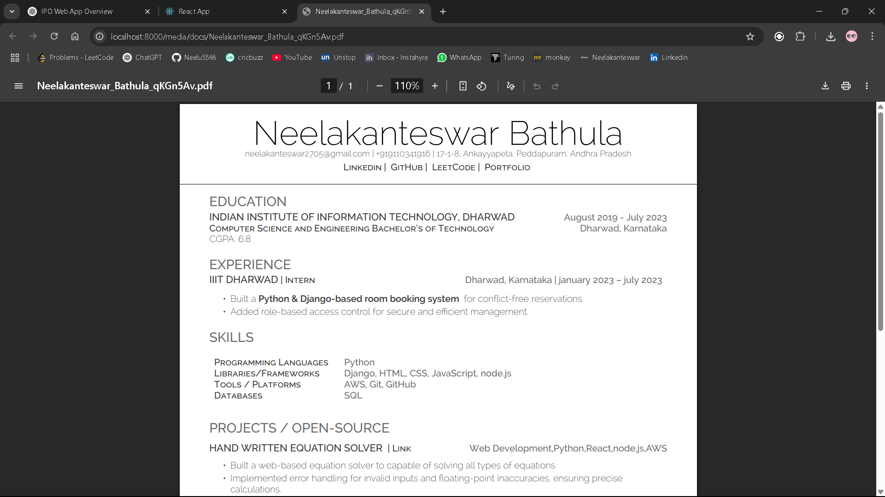

# IPO Web App

An interactive web application for managing and exploring IPO (Initial Public Offering) listings. This app allows admins to add, edit, and manage IPO records and users to browse detailed IPO information.

---

## 🚀 Features

* 📃 View all live and upcoming IPOs with details
* 🔍 Search IPOs by company name
* 👨‍💼 Admin login and dashboard for adding/editing IPOs
* 👤 User signup/login for personalized access
* 📎 Upload & download company logos, RHP & DRHP PDFs
* 🔐 Protected routes for admin and user access

---

## 📸 Screenshots

### 1. Home Page



### 2. Signup Page



### 3. User Login Page



### 4. Admin Login Page



### 5. Admin Dashboard - Add New IPO



### 6. IPO Details Page



### 7. Admin Access Denied Alert



### 7. RHP and DRHP page


---

## 🛠 Tech Stack

* **Frontend:** React.js, Tailwind CSS
* **Backend:** Django, Django REST Framework
* **Database:** SQLite

---

## ✨ How to Run Locally

### Backend (Django)

```bash
cd ipo-web-app
python -m venv venv
venv\Scripts\activate
pip install -r requirements.txt
python manage.py makemigrations
python manage.py migrate
python manage.py runserver
```

### Frontend (React)

```bash
cd client
npm install
npm start
```

---

## 🧪 Dummy Admin Credentials

* **Username:** neelu
* **Password:** Neelu@02

> Admin must be created via Django admin panel (`http://127.0.0.1:8000/admin`)

---

## 📂 Project Structure

```
ipo-web-app/
|-- client/              # React frontend
|-- ipo/                 # Django app for IPO
|-- media/               # Uploaded logos & PDFs
|-- static/              # Static files
|-- templates/           # Django templates (if any)
```

---

## 🧾 License

This project is for educational and internship submission purposes.

---

## 🙋‍♂️ Author

**Neelakanteswar Bathula**
[Portfolio](https://neelakanteswar.vercel.app)

---

> If you found this helpful, don't forget to ⭐ the project!
